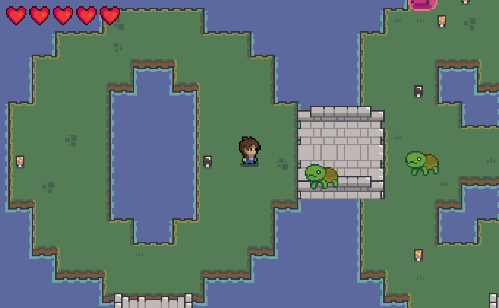

# THE game

Bienvenidos a uno de los mejores juegos rogue-like que ha salido esta semana. Este juego ha sido programado en el lenguaje de programación C y utilizó la librería gráfica [raylib](https://www.raylib.com/index.html).

Nuestro juego genera un mapa aleatorio cada pártida, en donde se generan nuevos enemigos. Tu objetivo es sobrevivir e intentar deshacerte de la mayor cantidad de enemigos posibles, para esto, puedes utilizar la ayuda de las aguas (pociones) de sabor que tiene la fauna del archipiélago.

## Controles

| Tecla   | Acción                     |
| ------- | -------------------------- |
| W       | Moverte hacia arriba       |
| A       | Moverte hacia la izquierda |
| S       | Moverte hacia abajo        |
| D       | Moverte hacia la derecha   |
| P       | Abrir el menú de pausa     |
| Espacio | Atacar                     | 

## Funcionamiento

- Acerca de la [generación del mundo](./docs/mapa.md)
- Acerca de la [jugabilidad](./docs/juego.md)
- Acerca del renderizado (por documentar)

---

¿Dudas acerca de la fauna y objetos de nuestro juego? Te recomendamos leer la bitácora de investigación de uno de nuestros biólogos que vive por la zona.

- [Bitácora de investigación](./docs/lore.md) 

## Créditos

- Los enemigos y las aguas de sabor fueron dibujadas por @Yael, que grande. 
- Este juego utilizó las texturas ofrecidas por @analogstudios, link a su paquete de [texturas](https://analogstudios.itch.io/forest)