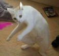

Regresar al [readme](../README.md)

---

# Jugabilidad

Dentro de juego.c y juego.h nos podemos encontrar con las funciones que se encargan del funcionamiento principal dentro del programa además de varias structs que nos permiten agrupar la información de las distintas entidades u objetos que aparecen en el juego. Estas son:

- **Player:**

```
struct player{
    Rectangle hitbox;   
    Rectangle arma;     
    int vida;           
    int max_vida;
    int side[2];        
    float speed;        
    int damage;
    int facing;         
    int state;          
    List* awas;          
    int timer_damage;
    int timer_atack;
    int timer_awas;
};
```
- **Enemy**
```
struct enemy{
    Rectangle hitbox;   
    int type;           
    int vida;           
    float speed;        
    int damage;
    float vision;        
    int timer;           
    int facing;
    int timer_extra;
};
```
- **AwadeSabor**
```
struct awas{
    int sabor;
    Rectangle ubicacion;
    Rectangle sprite;
};
```
- **Wall**
```
struct wall{
    Rectangle hitbox;
};
```

En general las funciones que pueden llamarse desde main se agrupan en 3, funciones para crear que devuelven un apuntador a lista con un solo tipo de struct o un apuntador a struct en el caso del jugador (llámese spawn, create, summon, etc.), funciones para actualizar los datos de lo obtenido (manage) y funciones para dibujar (draw), además de otras más específicas o como de apoyo para las ya mencionadas.

## **Funciones create y draw**

```create_player``` no tiene gran misterio, únicamente inicializa cada campo de la struct en valores que se necesitan, ubicándolo en un tile específico cuyas coordenadas son dadas desde las funciones de la creación del mapa devolviendo un apuntador a Player, lo mismo con ```spawn_awas``` con la única diferencia de que esta devuelve un apuntador a lista que es usada para guardar las distintas aguas que aparecen tras matar un enemigo.
```create_walls``` y ```summon_enemies``` de igual forma generan una lista donde se inicializan cada una de sus respectivas estructuras, ubicándolos gracias a un gran ciclo que recorre la matriz dada desde la función que genera el mapa. Dentro de ```summon_enemies``` además se asignan de forma aleatoria las distintas estadísticas como vida, velocidad y daño dependiendo del tipo de enemigo gracias a la función ```asign_stats``` que en esencia es un gran switch.
Tanto ```draw_enemies``` como ```draw_awa``` aprovechan que las imágenes usadas para crear sus texturas se encuentran distribuidas de una forma específica para que los rectángulos de DrawTextureRec salgan a partir de cálculos con la información de cada struct, es decir, recorren sus respectivas listas, dependiendo del tipo de awa o enemigo se ubica el rectángulo y a partir de la hitbox de cada dato se ubica en el mapa donde el sprite debe dibujarse.

 Yo había ponido el ```draw_player``` [aquí](./render.md#personajes)

## **Funciones manage**

```manage_awas ``` recorre la lista en donde se encuentran las pociones tiradas para encontrar si el jugador colisiona con estas mimas, de ser así la poción que en este caso es un apuntador a la struct de ese tipo es eliminado de la lista global y añadida al final de la lista del jugador a modo de stack, es decir, su inventario.

```manage_player``` es más compleja, en primer lugar nos encontramos con una condición que verifica si un control está conectado, dependiendo de esto es llamada la función ```move_player``` o ```move_pad_player``` las cuales funcionan de la misma forma, confirman si cierto botón está siendo presionado, ya sea las WASD en la computadora o la cruz en un control y si no hay una pared en la dirección que se quiere avanzar se modifica la posición del jugador con respecto a las coordenadas anteriores, a su vez se guarda la dirección en la que el jugador esta mirando.
En base a la dirección en la que se observa se crea el hitbox del arma para después mediante ```ataque_player``` confirmar si el botón de ataque, en este caso espacio, ha sido presionado, de ser así se modifica un timer que además de permitir dañar a los enemigos sirve para evitar que se ataque constantemente una y otra vez, si este timer está activo se actualiza cada frame para que después de x tiempo vuleva a ser cero.
Después de esto en ```use_awas``` se hace lo mismo, se confirma si el shift ha sido presionado para iniciar un timer, después se usa un pop en el inventario del jugador para eliminar la última poción si es que hay alguna y se modifican las estadísticas del jugador dependiendo del tipo de la poción, además de actualizar el timer si es que está activo.
Finalmente, la función regresa 1 si las vidas del jugador se han terminado y 0 siempre y cuando tenga más de 1 de vida.

```chocar_paredes``` puede considerarse como el manage del tipo de dato Wall, funciona recorriendo la lista de las paredes para avisar si el jugador está colisionando con alguna, de ser así se realizan ciertas restas y comparaciones con las coordenadas tanto de la pared involucrada como del jugador, dependiendo de esto el valor de side es cambiado avisando a la función ```move_player``` donde está la pared para impedir el movimiento en esa dirección, siendo 1 si está arriba, 2 a la derecha, 3 abajo y 4 a la izquierda. Claramente se puede chocar con hasta dos paredes a la vez por lo que side es una lista de dos valores.

```manage_enemies``` es de las más complejas, primero se recorre la lista de los enemigos al igual que en awas y paredes para trabajar con estos, después dependiendo del tipo de enemigo son llamadas dos funciones espécificas, ```pequeno```, el cual es llamado si el enemigo es un slime o de tipo 3 inicializando un contador si el jugador está a cierta distancia y si este termina se crea un nuevo enemigo del mismo tipo, y ```mimico``` que modifica la visión del enemigo de tipo 4 si el jugador se ha acercado lo suficiente.
A continuación, se llama a la función ```move_enemie``` que en base a cálculos modifica la posición de los enemigos en proporción a su velocidad si el jugador se encuentra dentro de su rango de visión, la única excepción sería para el enemigo número 5, el cangrejo, quien en caso de encontrarse en la dirección en la que el jugador está mirando huirá una distancia no mayor a su propia visión.
Finalmente tenemos ```lastimar_atacar``` el cual revisa si existe colisión entre el enemigo y el arma o el enmigo y el jugador, para modificar la salud de estos dependiendo del caso, usando a su vez timers para evitar un daño constante en ambas direcciones y actualizándolos cada frame en caso de que hayan sido iniciados.
