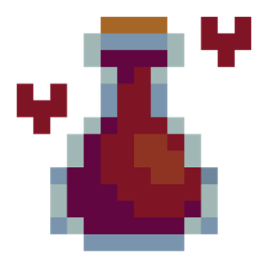
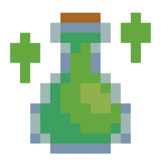
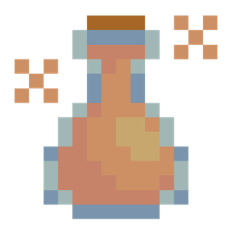
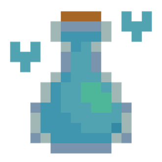
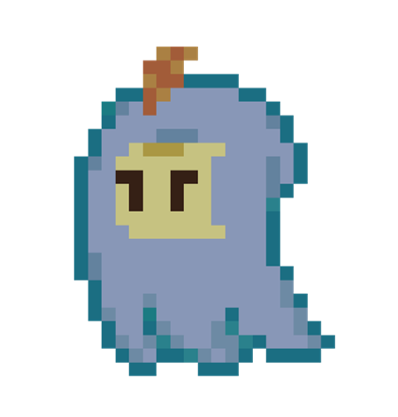
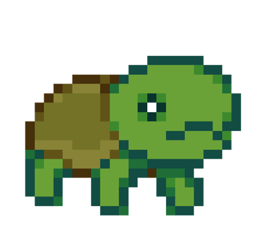
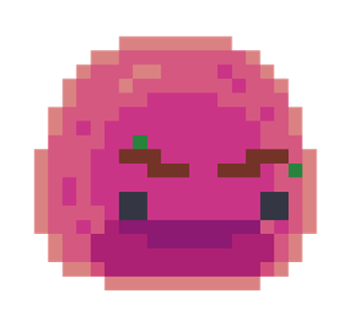
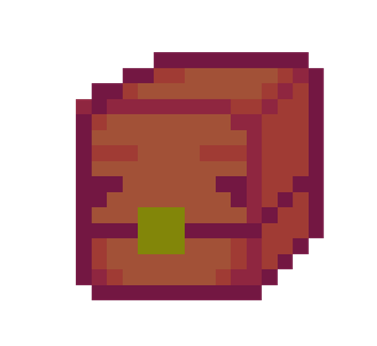
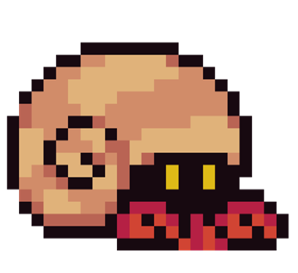

Regresar al [readme](../README.md)

---

## **Aguas (Pociones):**

Nadie sabe porque parte de la fauna del archipiélago suele llevar consigo frascos con distintos tipos de aguas frescas, sobre todo porque no hay agua dulce en los alrededores y a juzgar por el sabor que estas poseen no son fabricadas a partir del agua salada que les rodea. Algunos expertos han observado que la cantidad de hongos suele estar relacionada con la cantidad de aguas frescas presentes en la zona, pudiendo haber evolucionado para purificar el agua a la que tienen acceso en una especie de relación simbiótica con el resto de la flora del lugar, intercambiando nutrientes por agua no salada.

Sin embargo, esto sigue sin explicar de donde salen los frascos, dejando el origen de estos productos en la incógnita… y al señor que llega todos los días a vender agua en su puesto ambulante a los distintos animales de la zona a cambio de las gemas del lugar.

### **Agua de Jamaica:**

Los componentes de esta bebida tienen la propiedad de curar de sus heridas a cualquier persona que no se encuentren en plena salud y de refrescar a aquellas que sí lo estén, a pesar de dejar una sensación extraña en los dientes es comercializado a lo largo del mundo para crear la mejor medicina hasta la fecha, el acetaminofeno.

### **Agua de limón**

Pese a ser conocida de esta forma por la mayoría de las personas, en realidad nos encontramos ante agua de tamarindo, que como puede observarse parece de limón, pero con un sabor idéntico a la Jamaica.

Siendo la única diferencia el sabor agrio dejado tras ingerirse y la cantidad de azúcar que posee, potenciando en gran medida la energía de aquel que la consume, aunque por un periodo muy corto de tiempo.

### **Agua de horchata:**

Gracias a la gran cantidad de cereales y canela usados en su fabricación esta bebida permite a su consumidor aumentar en gran medida su fuerza durante un pequeño lapso, a pesar de quedar completamente mallugado cuando este termina. Si de por sí se desconoce el origen de las aguas, este sabor es aún más extraño debido a que se requiere leche en su fabricación, cosa que como puede observase no existe en la zona.

### **Agua natural:**

Agua completamente pura que no puede evaporarse ni congelarse por medio normales. Si bien no tiene sabor es bien conocido que su consumo ayuda a rejuvenecer a su usuario, teniendo capacidades curativas similares a la Jamaica cuya efectividad por desgracia es inversamente proporcional a la salud de la persona que hace uso de este líquido.

## **Fauna:**

El archipiélago se caracteriza por poseer una corta variedad de especies endémicas de la zona las cuales se han adaptado para transportarse fácilmente entre las distintas manchas de tierra, algo que en realidad no es tan complicado dado que en raras ubicaciones el agua llega a alcanzar más de 2 metros de profundidad, siendo una barrera únicamente para aquellos que teman mojarse o que absolutamente no puedan mantenerse flotando por cortas distancias.

Gran parte de los animales presentan una conducta agresiva, similar al resto de especies del continente de Oceanía, haciendo de la zona un territorio hostil para aquellos que no posean consigo un objeto llamativo o similares para distraer a las distintas creaturas de los alrededores.

### **Fantasma de bruma:**

Este extraño ser suele adornarse a sí mismo con distintos objetos que encuentra en su camino, llegando al punto de ocultar por completo su verdadera forma. Tras el arribo de humanos a la isla gran parte de estos animales empezaron a mostrar preferencia hacia los objetos traídos por estos mismos, siendo extraños hoy en día los fantasmas que se adornan con hierbas, conchas y similares. Estudios recientes apuntan a que su pariente vivo más cercano son los zanates, cosa que explicaría porque es común encontrar plumas en sus vestimentas.

### **Tortuga con traumas:**

Pariente cercano de las tortugas caimanes que han adoptado una forma de vida más pacífica, herbívora y terrestre. Dichos cambios han terminado por derivar en una especie con un tamaño mucho mayor al de su equivalente americano y con una vista capaz de detectar peligros a al menos dos cuadras panteoneras de distancia.

Si bien normalmente son mansas suelen proteger sus huevos ferozmente, cosa que las haría manejables de no ser porque al igual que las ardillas olvidan donde dejan enterradas a sus futuras crías, haciendo que protejan islas enteras de posibles amenazas, incluso si no hay huevos en estas.

### **Silme rosa:**

Colonia de organismos unicelulares de rápida división que trabajan juntos para maximizar la obtención de nutrientes de su medio. Su origen se atribuye a las extrañas agua del lago rosa de Australia, explicando la tonalidad tan característica de estos seres. Suelen poseer varias ramas y guijarros pegados en su cuerpo a suerte de rostro, cortesía de los fantasmas que suelen jugar con las colonias sabiendo que los distintos componentes inorgánicos que les adornan no los hace apetecibles hacia los slimes.

### **Cofre variopinto:**

Animal cuya verdadera forma no ha sido confirmada dado el extraño caparazón fabricado con troncos que usa tanto para su protección como para moverse y flotar entre las distintas masas de tierra del archipiélago. Los distintos avistamientos de la forma de este animal suelen ser bastante dispares entre sí, por lo que podríamos estar hablando de distintas especies que se aprovechan de la misma coraza de otro animal. Por alguna razón siempre traen consigo agua de algún sabor.

### **Cangrejo ermitaño gigante:**

Cangrejo bastante inteligente que caza en base a emboscadas, ya sea en grupo o solos. Si bien su caparazón es lo bastante fuerte como para protegerle suele huir ante cualquier indicio de peligro, evitando las peleas a toda costa y atacando siempre por la espalda.

Se le ha visto juntar fragmentos de madera para fabricar cofres que intercambia por comida o aguas a otros animales tales como pulpos, lagartos y mamíferos pequeños.