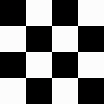

Regresar al [readme](../README.md)

---

# Acerca de la generación de mundos

Este apartado está dividido en dos librerias, ```map.h``` y ```load_map.h```:

## load_map

---

La única función pública de load_map.h es ```void load_maps(void);```
dicha función solo es invocada una vez en el juego en una condición de la que se hablará más adelante. 

Antes de seguir, es importante definir nuestra nomenclatura :

- **Raws:** Un raw es un archivo binario que contiene los datos de una matriz de 16x16, en donde el valor de un tile que pertenece a un oceano es 0 y el valor de un tile que pertenece al piso es de 1.
- **Maps:** Un map es una matriz de 16x16, similar al raw, pero se toma en cuenta cada textura diferente (Ya que decidimos utilizar un tile set), en donde se toma en cuenta si un tile perteneciente al oceano tiene como vecino a un tile de piso.

La función ```void load_maps(void)``` solo es invocada cuando los mapas no existen, pero se garantiza que los archivos raw siempre estarán. Esta función declara 2 matrices con las rutas de los archivos map y raw, después de su declaración, en un ciclo for de 8 iteraciones (Porque solo tenemos 8 mapas) declara una matriz local de 16x16 para ingresarle los datos de los mapas y procede a llamar 2 funciones. La primer función es ```load_raw(map, raws)```, que recibe como argumento la matriz local y el nombre del raw. 

- ```void load_raw(int map[16][16], char *name);``` Esta función abre en modo de solo lectura el archivo y le asigna a cada elemento de la matriz su valor correspondiente del archivo raw.

La segunda función es ```void write_map(int map[16][16], char *name, int index)```, en la que se toma el argumento index para poder arreglar 6 texturas específicas que nuestro algoritmo de generación no considera. Lo primero que hace la función es llamar a la función ```void write_map(map)```.

- ```void make_map(int map[16][16])```: Toma como argumento el mapa que se generó a partir de un archivo raw y se recorre cada elemento para revisar sus vecinos, para esto se creó un tipo de dato que contiene 4 enteros en donde se guarda el número de vecinos llamado Sides 
    ```
    typedef struct sides{
        int l;
        int r;
        int u;
        int d;
    }Sides;
    ```
    El nombre de sus elementos es la inicial de cada vecino adyacente (Left, Right, Up, Left). Por cada elemento que tenga como valor "0" (Que es el valor de un tile oceano) se revisa si el vecino que está revisando está dentro de la matriz con la función ```int is_inside(int x,int y)```, que simplemente regresa 1 si está dentro de los límites y 0 si no, para evitar accesos ilegales de memoria. Después de revisar sus vecinos, se llama a la función ```assign_value(sides)``` para darle un valor en función de su número de vecinos. 

     *Donde los cuadros rojos son los vecinos*
    
    Cada textura diferente es menor al valor del tile oceano, por lo que se vuelve a recorrer cada elemento del array pero esta vez para revisar los vecinos de las esquinas, al igual que en el caso pasado se hizo un tipo de dato que guarda las esquinas:

     *Donde los cuadros rojos son las esquinas*
    ```
    typedef struct edges{
        int lu;
        int ld;
        int ru;
        int rd;
    }Edges;
    ```
    Despues de contar las esquinas, se llama a la función ```assign_edges(edges)``` para darle un valor al elemento del array en función del número de sus vecinos. Se utilizaron dos funciondes diferentes ya que hacer las condicines para que considere los 8 vecinos era muy complicado, es por esto que las separamos en 2 funciones y los casos que nuestro algoritmo no contempla (Que son 6 casos) los agregamos de forma manual.

    Cuando se termina de generar el mapa, se agregan los casos anteriormente mencionados (si aplica) y se procede a guardar la matriz del mapa en un archivo mapa.

## map

---

En la libreria ```map.h``` están definidas 3 funciones públicas:
```
- void map_generate(int matrix[64][64], int bridges[64][64], Vector2 *vector);
- void map_draw(int matrix[64][64], Texture2D sprite, int *temp);
- void map_draw_bridges(int matrix[64][64], Texture2D sprite, Texture2D sprite_b);
```
Además, están definidos todos los diferentes tipos de textura que los archivos map tienen, sí, son más de 60.

Antes de empezar, se deben explicar algunas deciciones tomadas:

- El mapa del juego es una matriz de 64x64.
- Existe una segunda matriz de 64x64, que guardará el mapa con los puentes generados y la decoración, decidimos hacerlo de esta manera para evitar problemas con el renderizado de las texturas.

## map_generate()

---

La función void ```map_generate(matrix, bridges, vector)``` toma como argumento la matriz del mapa y de los puentes, adempas del apuntador de un vector2D, en donde se guardará la posición incial del jugador.

Lo primero que realiza esta función es asignarle a cada elemento del array el valor 0, ya que solo se había inicializado. Después se declara una matriz 4x4 llamada rooms, que será utilizada para la generación aleatoria de islas (Que llamamos cuartos).
Después, se llama la función ```rooms_generate(rooms)```, que recibe como argumento la matriz rooms, lo que hace esta función es asignarle a cada valor del array 0 y elegir una posición aleatora (En "x" y "y") para comenzar a generar los cuartos. Además, se genera un número aleatorio entre 0 y 3 que se le sumará a 7 para la cantidad de cuartos (El mínimo de cuartos es 7 y el máximo es 10).

Después se llama a la función ```rooms_fill(rooms, x, y, 7+(0 a 3)) ``` para comenzar la generación de los cuartos. 

- ```void rooms_fill(int rooms[4][4], int x, int y, int rep)```: Este algoritmo recibe la matriz de los cuartos, la posición aleatoria en "x" y "y" y el número de cuartos que se generarás (rep). El algoritmo entra en un ciclo while que terminará cuando rep == 0, lo primero que hace es revisar si la matriz en la posición dada es distinto de 1 (Para no contar más de una vez el mismo cuarto), en caso positivo reduce en una unidad rep y la matriz en esa posición se iguala a 1. 

    Lo siguiente que se hace es generar un número aleatorio entre 0 y 3, para entrar en un switch que revisa cada caso. Para el switch se utilizó una función auxiliar llamada ```room_is_inside(x, y)```, que revisa si la posición no se sale de la matriz. Si el número aleatorio es 0, se le resta 1 a la posición "x", si es 1, se le suma 1 a "x", si es 2, se resta 1 a "y", si es 3, se suma 1 a "y". Notese que si la posición en "x" o "y" es mayor a la dimensión de la matriz, no se hará nada.

    

Una vez que se tiene la matriz con los cuartos, se llama a la función ```rooms_insert(matrix, rooms, vector)```, que toma como argumento la matriz del mapa y de los puentes y el apuntador del vector.

- ```void rooms_insert(int matrix[64][64], int rooms[4][4], Vector2 *vector)```: En esta función se declara una matrix de chars con los nombres de los diferentes mapas. Lo primero que hace la función es guardar en un tipo de dato FILE* lo que regresa la función fopen() al abrir el primer mapa, si lo que regresa fopen() == NULL, entonces significa que no se han generado los mapas a partir de los archivos raw. Es importante aclarar que solo se revisa un archivo ya que la función ```load_maps(void)``` siempre genera los 8 a la vez. 

    Si no están generados los archivos, se cierra el archivo y se llama a la función ```load_maps()``` de la libreria "load_map.h", de lo contrario solo se cerrará el archivo.

    Después, se inicializa una variable llamada first, cuya función es obligar que el primer cuarto que se integre a la matriz principal sea la isla spawn. Entonces se recorre cada elemento de la matriz de los cuartos, si el elemento == 1, significa que hay un cuarto, así que se guarda la posición en "x" y "y" del cuarto (Que es la posición de la matrix * 16).

    Si la variable first es == 0, entonces se llama a la función ```rooms_replace(matrix, x, y, files[7], 0)```, se guarda en el vector la posición del jugador (Que es 4 tiles a la derecha y 7 tiles abajo de la esquina de la isla spawn) y se le suma 1 a la variable first. 

    De lo contrario, solo se genera un número del 0 al 6 (Que será el índice del archivo de mapa en la matriz de nombres. No llega a 7 porque en el indice 7 está el spawn) y se manda a llamar la función ```rooms_replace(matrix, x, y, files[random], 1)```

    - ```void rooms_replace(int matrix[64][64], int x, int y, char *name, int spawn_floor)```: Esta variable toma como argumento la matriz principal del mapa, la posición en donde está el cuarto, el nombre del archivo mapa y un entero llamado spawn_floor. Este último sirve para verificar si el mapa va a generar enemigos o no. 

        Esta función inicializa una matriz de 16x16 y, utilizando una función auxiliar llamada ```rooms_load(map, name)```, guarda en esa matriz los datos del archivo mapa. La función solo abre el archivo mapa en modo de solo lectura y le asigna a cada elemento de la matriz 16x16 su valor correspondiente.
        
        Después revisa si la variable spawn_floor es distinta de 0, si es distinta, entonces llama a otra función auxiliar llamada ```rooms_get_spawn(map)``` cuyo funcionamiento es el siguiente:

        Inicializa una variable en 0 para garantizar que al menos en un tile piso spawnee un enemigo. Esta función recorre la matriz 16x16 y si el elemento es == FLOOR, entonces existe una probabilidad del 2% que su tipo de dato se convierta a FLOOR_SPAWN (Estos datos están definidos en el archivo cabecera)

        Después de generar a los enemigos, simplemente se guarda en su posición correspondiente de la matrix principal del mapa los valores de la matriz 16x16.

En este punto ya terminamos de asignarle los valores a la matriz principal, por lo que copiamos sus valores a la matriz bridges (Que es la que va a contener los puentes y la decoración). Después se recorre la matriz rooms para hacer las conexiones de los puentes. 

**Importante:** Como la matriz se recorre de izquierda a derecha y de arriba hacia abajo, solo existe dos posibilidades, que el elemento tenga un cuarto a su derecha o abajo.

Para esto, utilizamos la función auxiliar ```room_is_inside(x,y)```, si el elemento es == 1, y su vecino derecho está dentro de la matriz, se revisa si es == 1, de ser así, se manda a llamar a la función ```rooms_connect_right(bridges, x, y)```, de lo contrario, no se hace nada.
También se revisa el vecino de abajo, si está dentro de la matriz y es == 1, entonces se llama a la función ```rooms_connect_down(bridges, x, y)```

- Funciones ```rooms_connect_right(bridges, x, y)``` y ```rooms_connect_down(bridges, x, y)```: Su funcionamiento es muy similar, por lo que explicaré utilizando a rooms_connect_right(). Lo que hace la función es guardar la posición en donde comenzará su búsqueda, que es 15 tiles a la derecha de la esquiza superior derecha (que es la posición en "x" y "y") y 7 tiles abajo. Estas posiciones se guardan en x_start y y_indes (Este último no cambiará). Y se inicializa una variable x_final con el valor de x_start.

    Para saber donde iniciar, se entra en un ciclo en donde se busca si el vecino izquierdo de la matriz[y_index][x_start] es un tile piso. Si no es, se le resta una unidad a x_start.

    Para saber donde terminar, se hace otro ciclo que ahora busca si el vecino derecho de la matriz[y_index][x_final] es un tile de piso. Si no es, se le suma una unidad a x_final.

    Ya que sabe donde iniciar y donde terminar, el algoritmo asigna las texturas indicadas a cada tile (El puente mide 4 tiles de ancho, en donde las 2 tiles de los extremos se consideran muros que el jugador no puede atravesar).

    Para la función ```rooms_connect_down(bridges, x, y)``` se hace exactamente igual, solo que la búsqueda se hace en el eje de las "y", además de que se agrega una textura extra en el final del puente por cuestión de estética.
        
Para finalizar, se manda a llamar a la función ```rooms_insert_decoration(bridges);```, que lo único que hace es recorrer la matriz bridges y en caso de que el elemento sea un tile piso, existe un 12% de probabilidad de que se le agregue una textura de decoración (Ya sean champiñones o pasto) al tile. 